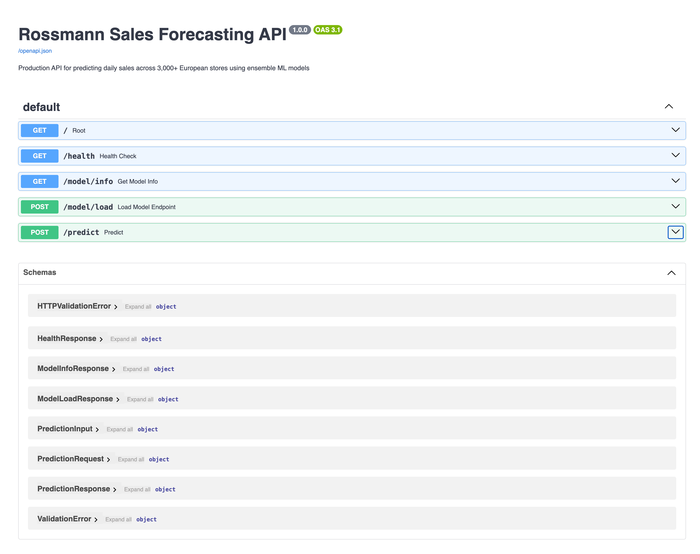
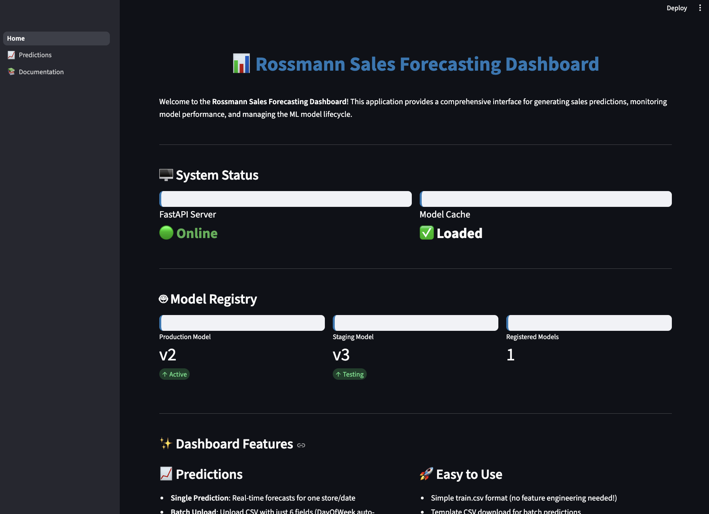

# Welcome {background="#43464B"}

## Applied Workshops Series {background-image="assets/images/bridge.jpg" background-size="cover" background-position="center"}

**Bridging the gap between classroom and industry**

<br><br><br><br><br><br><br><br>

[This series shares best practices and industry standards not always covered in coursework --- practical skills that can differentiate you early in your career.]{style="color: white;"}

::: {.notes}
Frame this as part of the applied workshop series. These workshops focus on practical skills that matter in industry but are often underrepresented in coursework. Today we move from experiment tracking into making models actually usable.
:::

## Today's Agenda {.smaller}

<br>

1. **Deployment Concepts**: What deployment actually means
2. **Prototyping Approach**: Building usable systems without production infrastructure
3. **Live Demo**: Rossmann forecasting project walkthrough
4. **Your Final Project MVP**: Expectations and getting started

<br>

::: {.callout-tip}
## Today's Goal
Walk out knowing how to take a trained model and make it into something people can actually use.
:::

::: {.notes}
- This is practical and applied - we'll start with concepts, build up to architecture, and see a real system
- The focus is on making models accessible and usable, not production deployment
- We'll use the Rossmann project as a concrete example throughout
- By the end you should be able to start building a prototype for your own final project
- This workshop bridges the gap between model training and stakeholder interaction
:::

# The Problem {background="#43464B"}

## When Does a Model Create Value?

<br>

::: {style="text-align: center; font-size: 1.5em;"}
Experiments and registered models don't create **value**.
<br><br>
They help us find the **best** model.
:::

<br>

::: {.callout-important}
## The Reality
Models don't create value by existing. They create value by being **used**.
:::

::: {.notes}
- This is the anchor idea for the entire workshop
- You've learned to track experiments in MLflow and register your best models
- That helps you understand model performance and select which model to use
- But tracking and registering a model doesn't make it usable yet
- Value comes when a stakeholder, a decision-maker, or a system can interact with the model's predictions
- The gap between "I selected my best model" and "someone is using this model" is what we're addressing today
:::

## Most Models Never Get Used

::: {.columns}
::: {.column width="60%"}
**What typically happens:**

::: {.incremental}
- We train hundreds of models during experimentation
- We select the best model
- Results shared as static reports
- Stakeholder can't interact with it
- Model gets stale and forgotten
:::
:::

::: {.column width="40%"}

:::
:::

::: {.notes}
- This is extremely common in industry, not just in school
- During experimentation, you may train dozens or hundreds of model variations
- You select the best performing model and register it in MLflow
- But then what? Results get shared as a PDF or slide deck
- The stakeholder can't ask "what if" questions, can't try different inputs
- There's no way to use the model on new data without calling the data scientist
- Our objective is to create a system around our preferred model that makes it usable
- Over time, without this system, the model just fades away --- nobody maintains it, nobody uses it
:::

## The Gap

::: {.callout-important}
## Stakeholders don't want your code
They want your **answers**.
:::

::: {.columns}
::: {.column width="60%"}
- Don't care about your feature engineering pipeline
- Want to ask: "What will sales look like next week if we run a promotion?"
- Want to upload a spreadsheet and get predictions back
:::

::: {.column width="40%"}
{width="70%"}
:::
:::

::: {.notes}
- Put yourself in the stakeholder's shoes: they don't care about your feature engineering pipeline
- They want to ask: "What will sales look like next week if we run a promotion?"
- They want to upload a spreadsheet and get predictions back
- Our job as data scientists extends beyond modeling --- we need to make models accessible
- This is increasingly a differentiating skill in the job market
:::

## Abstracting Technical Complexity

<br>

::: {.callout-important}
## Remember Your Users
Your ML system will be used by stakeholders who:

- May lack technical ML knowledge
- Don't have time to provide 50+ detailed inputs
- Can't interpret raw model outputs
:::

<br>

::: {style="text-align: center; font-size: 1.2em;"}
Our system must **hide** the technical nuances.
:::

::: {.notes}
- This is a critical design principle: your users are not data scientists
- They may be store managers, business analysts, marketing directors
- They don't know what a lag feature is or why you need rolling statistics
- They don't have time to manually fill in 46 feature values
- And they can't interpret a raw prediction without context
- Our job is to abstract away the complexity: simple inputs, clear outputs
- The system handles feature engineering, model loading, prediction formatting behind the scenes
- DISCUSSION OPPORTUNITY: Have each group spend 2-3 minutes thinking about:
  - Who are your end users?
  - What technical nuances need to be hidden from them?
  - What are the minimum inputs you need from them?
  - What outputs do they actually care about?
:::

## Our Goal

<br>

::: {.callout-note}
## Learning What Goes Into Deployment
Part of this class is understanding what it takes to deploy a model.

**The reality:**

- Full deployment is extremely challenging
- It often requires technical support from engineers
- Production infrastructure takes significant time and resources
:::

<br>

::: {style="text-align: center; font-size: 1.3em;"}
We start by demonstrating how our models could be **usable** to stakeholders.
:::

::: {.notes}
- This class is about understanding what goes into deploying a model
- The chapter readings cover more complicated deployment concerns: infrastructure, scaling, security, CI/CD
- But we need to acknowledge the reality: full production deployment is extremely challenging
- You will typically have technical support from engineers to make true production deployment happen
- So where do we start as data scientists?
- The first step is demonstrating at a basic level how our models could be usable to the stakeholder
- We focus on building a simplistic ML system that mimics a deployment framework
- This is often exactly how it works in industry: you start with a simple prototype that proves the concept
- Then, with engineering support, it matures into a true production deployment framework
- Today we're focusing on that first step: making something usable that demonstrates value
:::

# Deployment Concepts {background="#43464B"}

## What Is Deployment?

<br>

::: {.callout-note}
## Deployment
Making a trained model accessible so it can receive inputs and return predictions.
:::

<br>

::: {style="text-align: center;"}
```{mermaid}
%%| fig-width: 9
flowchart LR
    A["📥 Input Data"] --> B["🤖 Model"]
    B --> C["📤 Predictions"]

    style A fill:#e1f5fe
    style B fill:#fff3e0
    style C fill:#e8f5e9
```
:::

. . .

::: {.callout-warning}
Unfortunately, this simple view hides the complexity of what it really takes to deploy a model in production!
:::

::: {.notes}
- At its simplest, deployment is just this: input goes in, prediction comes out
- The model becomes a service that other things can talk to
- Right now your models probably work like this: open notebook, load data, run cells, read output
- Deployment means wrapping that in something others can access without opening your notebook
- The mechanism can be an API, a web app, a scheduled job --- but the core idea is the same
:::

## What Production Actually Involves {.smaller}

::: {.incremental}
- **Model Registry & Versioning** --- managing model updates without breaking things
- **APIs** --- endpoints that accept requests and return predictions
- **UIs** --- user interfaces to allow stakeholders to interact with the model
- **Infrastructure** --- servers, containers, scaling, uptime
- **Security** --- authentication, data protection, access control
- **Monitoring** --- tracking performance, detecting drift, alerting
- **CI/CD** --- automated testing, deployment pipelines
- [and sometimes far more!]{style="color: red;"}
:::

::: {.notes}
- This is the full picture of what "production deployment" looks like in industry
- APIs are how most models get served: REST endpoints that accept JSON and return predictions
- Infrastructure means someone has to keep the servers running, handle load spikes, manage containers
- Security is critical: you can't just expose a model to the internet without authentication
- Monitoring ensures the model keeps working correctly over time
- CI/CD automates the process of testing and deploying new model versions
- Versioning lets you update models safely (canary deployments, blue-green, shadow)
:::

## Production ML System Architecture {.smaller .scrollable}

```{mermaid}
%%| fig-width: 12
flowchart LR
    User["👤 <b>User</b><br/><i>Stakeholder, Analyst,<br/>Business User</i>"]

    subgraph UI["User Interface Layer"]
        Web["Web UI<br/><i>Streamlit, Gradio, React</i>"]
        Mobile["Mobile Apps<br/><i>iOS, Android</i>"]
    end

    subgraph API["API Layer"]
        Gateway["API Gateway<br/><i>Kong, AWS API Gateway</i>"]
        Auth["Authentication<br/><i>OAuth2, JWT</i>"]
    end

    subgraph Serving["Model Serving"]
        FastAPI["FastAPI/Flask"]
        ModelServer["Model Server<br/><i>TensorFlow Serving, Triton</i>"]
    end

    subgraph Registry["Model Registry & Versioning"]
        MLflow["MLflow Registry"]
        Storage["Model Storage<br/><i>S3, GCS, Azure Blob</i>"]
    end

    subgraph Infra["Infrastructure"]
        Container["Containers<br/><i>Docker</i>"]
        Orchestration["Orchestration<br/><i>Kubernetes, ECS</i>"]
        LoadBalancer["Load Balancer<br/><i>NGINX, AWS ALB</i>"]
    end

    subgraph Monitor["Monitoring & Logging"]
        Metrics["Metrics<br/><i>Prometheus, CloudWatch</i>"]
        Drift["Drift Detection<br/><i>Evidently, WhyLabs</i>"]
        Logs["Logging<br/><i>ELK Stack, Splunk</i>"]
    end

    subgraph CICD["CI/CD Pipeline"]
        Test["Testing<br/><i>Pytest, Great Expectations</i>"]
        Deploy["Deployment<br/><i>GitHub Actions, Jenkins</i>"]
        Version["Version Control<br/><i>Git, DVC</i>"]
    end

    User --> Web
    User --> Mobile
    Web --> Gateway
    Mobile --> Gateway
    Gateway --> Auth
    Auth --> FastAPI
    FastAPI --> ModelServer
    ModelServer --> MLflow
    MLflow --> Storage

    FastAPI --> Container
    Container --> Orchestration
    Orchestration --> LoadBalancer

    FastAPI --> Metrics
    FastAPI --> Drift
    FastAPI --> Logs

    Version --> Test
    Test --> Deploy
    Deploy --> Container

    style User fill:#ffebee,stroke:#c62828,stroke-width:3px
    style UI fill:#e1f5fe
    style API fill:#f3e5f5
    style Serving fill:#fff3e0
    style Registry fill:#e8f5e9
    style Infra fill:#fce4ec
    style Monitor fill:#fff9c4
    style CICD fill:#f0f4c3
```

::: {.notes}
- This diagram shows the complexity of a real production ML system
- Notice the User on the left: the stakeholder, analyst, or business user who needs predictions
- The user only interacts with the User Interface layer - they're shielded from all the complexity to the right
- Each box represents a major component with production-grade tools
- Notice how many moving parts there are compared to the simple notebook workflow
- User Interface layer: web apps, mobile apps for stakeholder interaction
- API layer: gateway for routing, authentication for security
- Model serving: FastAPI or specialized model servers for predictions
- Registry: MLflow for versioning, cloud storage for model artifacts
- Infrastructure: containers, orchestration (Kubernetes), load balancing
- Monitoring: metrics tracking, drift detection, centralized logging
- CI/CD: automated testing, deployment pipelines, version control
- All of these components need to work together seamlessly
- This is why we say production deployment is hard and requires engineering support
:::

## This Is Hard

<br>

::: {style="text-align: center; font-size: 1.3em;"}
Production deployment requires:
:::

<br>

::: {.incremental}
- Engineering teams and infrastructure support
- Significant time investment
- Organizational buy-in and resources
:::

<br>

::: {.callout-warning}
## Reality Check
Most data science teams don't have this. Especially not for a class project.
:::

::: {.notes}
- Be honest about this: real production deployment is a team sport
- It involves DevOps engineers, platform teams, SREs
- It takes weeks or months to set up properly
- Most companies are still figuring this out, let alone student projects
- So what do we do? We don't skip deployment entirely --- we prototype
- This is where the practical value of today's workshop comes in
:::

## But We Can Start Somewhere

<br>

::: {style="text-align: center; font-size: 1.3em;"}
We may not build the **entire** production system...
<br><br>
But we **can** build working prototypes.
:::

<br>

::: {.incremental}
1. **Turn a model into a usable system** that demonstrates what production could look like
2. **Use tools and patterns** that naturally migrate to production when the time comes
:::

::: {.notes}
- Here's the key insight: you don't need to wait for full production infrastructure to make progress
- We can build working prototypes that demonstrate the value of our models
- These prototypes turn a model into something usable - something stakeholders can interact with
- They show what a production system could look like without requiring the full complexity
- And critically, we'll use tools and patterns that are production-ready
- FastAPI, Streamlit, MLflow - these aren't toy tools, they're used in real production systems
- When you do get engineering support, your prototype becomes the foundation, not throwaway code
- This is a practical middle ground: make your model usable now, build toward production later
:::

# Prototyping {background="#43464B"}

## You Don't Need Production Infrastructure

<br>

::: {style="text-align: center; font-size: 1.2em;"}
A prototype **simplifies** the architecture.
<br><br>
But when done smartly, it doesn't add **tech debt**.
:::

<br>

::: {style="text-align: center;"}
```{mermaid}
%%| fig-width: 10
flowchart LR
    A["🧪 Models"] --> B["🔧 Prototype System"]
    B --> C["🏭 Production"]

    style A fill:#ffcdd2
    style B fill:#4caf50,stroke:#2e7d32,stroke-width:4px
    style C fill:#e1f5fe
```
:::

::: {.notes}
- You don't need production infrastructure to make a model usable
- A prototype simplifies the architecture - fewer components, less complexity
- But here's the key: when done smartly, it doesn't create tech debt
- How? By using production-ready tools and patterns from the start
- FastAPI, Streamlit, MLflow - these are the same tools you'd use in production
- You're not building throwaway code, you're building a foundation
- When engineering support arrives, you extend the prototype, you don't rewrite it
- This is strategic prototyping: start simple, but start right
:::

## What Makes a Usable Prototype?

<br>

1. **User can provide input** --- forms, uploads, selections
2. **Model generates predictions** --- real-time or batch
3. **Results are understandable** --- clear output, context, interpretation
4. **It actually runs** --- not just a notebook, but a working system

::: {.callout-note}
Notice what's **NOT** on this list: scalability, security, monitoring, CI/CD. Those matter for production. For a prototype, usability is what counts.
:::

::: {.notes}
- A usable prototype has these four properties
- User input: the stakeholder can control what goes into the model
- Predictions: the model actually runs and produces output
- Understandable: the results make sense to someone who isn't a data scientist
- It runs: you can start it up and someone can use it without your help
- Notice what's NOT on this list: scalability, security, monitoring, CI/CD
- Those matter for production. For a prototype, usability is what counts.
:::

## A Common Prototype Stack {.smaller}

<br>

```{mermaid}
flowchart LR
    User["👤 <b>User</b>"] --> A["<b>Streamlit</b><br/>User interface"]
    A --> B["<b>FastAPI</b><br/>Model serving"]
    B --> C["<b>MLflow</b><br/>Model registry"]

    style User fill:#ffebee,stroke:#c62828,stroke-width:3px
    style A fill:#e8f5e9
    style B fill:#fff3e0
    style C fill:#e1f5fe
```

<br>

| Component | Role | Why |
|-------|----------|---------|
| **Streamlit** | User-facing interface | No frontend skills needed |
| **FastAPI** | Serve predictions via API | Fast, Python-native, auto-docs |
| **MLflow** | Model versioning & loading | Track and retrieve models |

::: {.notes}
- This is a common stack we'll use, and it's the same stack used in the Rossmann project
- Notice the User on the left - they interact with Streamlit, not the technical components
- MLflow: you've already seen this for experiment tracking. Here we use it to store and load trained models.
- FastAPI: a Python web framework for building APIs. It's fast, it auto-generates documentation, and it's pure Python
- Streamlit: a Python library for building web UIs. You write Python, it generates a web app. No HTML, CSS, or JavaScript needed.
- This stack is intentionally simple: all Python, minimal dependencies, runs locally
- It's also realistic: FastAPI is widely used in industry for model serving
- The user only sees Streamlit - the complexity is hidden behind the interface
:::

## Prototype Architecture {.smaller}

```{mermaid}
%%| fig-width: 10
flowchart LR
    A["👤 User"] --> B["🖥️ Streamlit UI"]
    B -->|"API Request"| C["⚡ FastAPI"]
    C -->|"Load Model"| D["📦 MLflow Registry"]
    D --> C
    C -->|"Feature Engineering<br/>+ Prediction"| E["🤖 Model"]
    E --> C
    C -->|"Log"| F["📊 Prediction DB"]
    C -->|"Response"| B
    B -->|"Display"| A

    style A fill:#f3e5f5
    style B fill:#e8f5e9
    style C fill:#fff3e0
    style D fill:#e1f5fe
    style E fill:#fce4ec
    style F fill:#f5f5f5
```

. . .

| Layer | Responsibility | User Sees? |
|-------|---------------|------------|
| **Streamlit** | Input forms, result display, monitoring dashboards | Yes |
| **FastAPI** | Feature engineering, model serving, prediction logging | No |
| **MLflow** | Model storage, versioning, stage management | No |
| **SQLite** | Prediction history, drift detection data | No |

<br>

::: {style="text-align: center; font-size: 1.2em;"}
The user sees the **interface**.
<br>
The system handles the **complexity**.
:::

::: {.notes}
- Here's how the pieces fit together in the Rossmann project
- The user interacts with Streamlit --- they fill in a form or upload a CSV
- Streamlit sends the input to FastAPI as an API request
- FastAPI loads the model from MLflow (cached after first load for speed)
- FastAPI runs the full feature engineering pipeline --- the user provides 7 simple fields, the API engineers 46 features
- The model generates predictions
- Predictions are logged to a SQLite database for monitoring
- Results are sent back to Streamlit and displayed to the user
- Key insight: the user never touches feature engineering, model loading, or any technical detail
:::

## The Rossmann Project {.smaller}

<br>

::: {.columns}
::: {.column width="60%"}
**Sales forecasting** for 1,115 Rossmann retail stores across Europe.

- Trained ensemble model (XGBoost, LightGBM, CatBoost)
- 46 engineered features from 7 user inputs
- MLflow model registry with versioning
:::

::: {.column width="40%"}
```{mermaid}
%%| fig-width: 4
flowchart TD
    A["XGBoost<br/>60%"] --> D["Ensemble"]
    B["LightGBM<br/>30%"] --> D
    C["CatBoost<br/>10%"] --> D
    D --> E["Prediction"]

    style A fill:#e1f5fe
    style B fill:#e8f5e9
    style C fill:#fff3e0
    style D fill:#f3e5f5
    style E fill:#fce4ec
```
:::
:::

<br>

::: {.callout-note}
# Next step:

How can we turn this into a **prototype** that a user could actually interact with, without needing to understand the underlying model or feature engineering?
:::

::: {.notes}
- This is the real project we'll demo --- Rossmann is a European drugstore chain
- The model predicts daily sales for individual stores
- It uses a weighted ensemble: XGBoost (60%), LightGBM (30%), CatBoost (10%)
- Key thing to notice: the user provides just 7 simple fields --- store number, date, whether they're open, promotion status, holidays
- The API handles all 46 features behind the scenes: calendar features, lag features, rolling statistics, store metadata
- This is the pattern you want to follow: simple inputs, complex processing hidden from the user
:::

## What to Watch For

<br>

During the demo, pay attention to:

::: {.incremental}
1. **How simple the user inputs are** --- 7 fields, not 46
2. **How the system handles complexity** --- feature engineering is automatic
3. **How predictions are displayed** --- clear, contextual, interpretable
4. **How the pieces communicate** --- Streamlit → FastAPI → Model → Response
:::

::: {.notes}
- Before we jump in, I want you to watch for these specific things
- The simplicity of the inputs is intentional: a store manager could use this
- Feature engineering is fully automated in the API --- the user never sees it
- The predictions come back with context, not just a number
- Watch how Streamlit calls FastAPI and displays the results
:::

## From Architecture to Code {.smaller}

::: {.columns}
::: {.column width="50%"}
**System Architecture:**

```{mermaid}
flowchart TB
    subgraph Registry["MLflow Model Registry (Port 5000)"]
        MR[(Model Storage)]
        MV[Version Management]
        MS[Stage Tracking]
    end

    subgraph API["FastAPI Service (Port 8000)"]
        direction TB
        ML[Model Loader]
        PP[Prediction Pipeline]
        FE[Feature Engineering]
        VAL[Input Validation]
    end

    subgraph UI["Streamlit Dashboard (Port 8501)"]
        direction TB
        SP[Single Prediction]
        BP[Batch Upload]
        VIZ[Results Display]
    end

    subgraph User["End Users"]
        
    end

    User --> UI
    UI -->|HTTP POST| API
    API -->|Load Model| Registry
    Registry -->|Ensemble Model| API
    API -->|Predictions| UI
    UI -->|Results| User

    style Registry fill:#e1f5ff
    style API fill:#fff4e1
    style UI fill:#f0f0f0
    style User fill:#e8f5e9
```
:::

::: {.column width="50%"}
**File Structure:**

```
rossmann-forecasting/
├── deployment/
│   ├── api/
│   │   └── main.py          ← FastAPI app
│   └── streamlit/
│       ├── Home.py          ← Main UI
│       └── pages/           ← Individual UI pages
│           ├── 1_📊_Predictions.py
│           └── 2_📈_Monitoring.py
├── mlruns/                  ← MLflow tracking
│   └── models/              ← Model artifacts
│ 
└── src/                     ← Source code
```
:::
:::

::: {.callout-note}
FastAPI will use scripts from the `src/` directory for input validation, feature engineering, making predictions, etc.
:::

::: {.notes}
- This slide connects the conceptual architecture to the actual code
- Left side: the simple architecture we've been discussing
- Right side: where these components actually live in the Rossmann project
- FastAPI app: deployment/api/main.py - this is the prediction API
- Feature engineering: deployment/api/features.py - handles all 46 features
- Streamlit UI: deployment/streamlit/ - the user interface with multiple pages
- MLflow: mlruns/ directory stores experiment tracking and model registry data
- Models: models/ directory contains saved model artifacts
- This is a clean, organized structure you can replicate in your own projects
- Notice the separation: API code is separate from UI code, making it easy to maintain
:::

## Making Models Accessible: REST APIs {.smaller}

<br>

::: {style="font-size: 1.3em;"}
**Last class:** MLflow manages and versions our models
<br><br>
**This class:** We need a way to **interact** with those models
:::

<br>

::: {.callout-note}
# REST API (Application Programming Interface)

A standardized way to send requests and receive responses over HTTP.

- Send input data → Get predictions back
- Language-agnostic (works with Python, R, JavaScript, etc.)
- Industry standard for model serving
:::

::: {.notes}
- Last class we saw how MLflow tracks experiments, registers models, and manages versions
- MLflow gives us a registry - a central place where our models live
- But MLflow alone doesn't let us actually USE the model - we need a way to send data and get predictions
- That's where REST APIs come in - they're a standardized way to interact with services over the web
- Think of an API as a waiter at a restaurant: you give the waiter your order (input), they take it to the kitchen (model), and bring back your food (prediction)
- REST APIs use HTTP - the same protocol your browser uses - so they're language-agnostic
- You can call a Python API from R, JavaScript, curl, anything that speaks HTTP
- This is the industry standard for serving models - whether you're at a startup or Google, you're likely using REST APIs
:::

## FastAPI: Building REST APIs in Python {.smaller}

<br>

::: {.columns}
::: {.column width="50%"}
**Why FastAPI?**

- Python-native (no new languages)
- Auto-generated documentation
- Built-in input validation
- Fast and production-ready
:::

::: {.column width="50%"}
**What it provides:**

- `/predict` endpoint for predictions
- `/health` endpoint for status checks
- `/docs` interactive API explorer
- Type checking and error handling
:::
:::

<br>

::: {.callout-warning}
# The limitation:

FastAPI is **not a user interface**. It's designed for developers and systems, not stakeholders.
:::

::: {.notes}
- FastAPI is a Python framework specifically designed for building REST APIs quickly
- Big advantage: it's Python, so we don't need to learn Java, Go, or other backend languages
- It auto-generates interactive documentation at /docs - you can test your API right in the browser
- It validates inputs automatically using Python type hints - if someone sends invalid data, FastAPI catches it
- And despite the name, it really is fast - comparable to Node.js and Go for performance
- In our Rossmann project, FastAPI provides several endpoints: /predict for getting predictions, /health for checking if the system is running, /docs for exploring the API
- The key limitation: while you CAN interact with the model through FastAPI, the interface is very technical
- It's designed for developers making programmatic calls, or for other systems to integrate with
- A business stakeholder doesn't want to write JSON and make HTTP POST requests
- Demo plan: I'll show you MLflow UI with our registered models, then launch FastAPI and show the /docs endpoint, then make a prediction
- You'll see that while it works, it's not the kind of interface you'd hand to a store manager or executive
- This is exactly why we need Streamlit - to put a user-friendly face on this API
:::

## Demo: FastAPI {.smaller}

<br>

::: {.columns}
::: {.column width="50%"}
**Launch the services:**

1. Start MLflow UI:
```bash
bash scripts/start_mlflow.sh
```

2. Launch FastAPI:
```bash
bash scripts/launch_api.sh
```

<br>

- MLflow UI: `http://localhost:5000`
- FastAPI: `http://localhost:8000/docs`
:::

::: {.column width="50%"}
::: {style="text-align: center;"}

:::
:::
:::

::: {.notes}
- Let's see this in action - I'll launch both services
- First, start MLflow UI with bash scripts/start_mlflow.sh - this opens the model registry on port 5000
- Navigate to localhost:5000 and show the registered models, point out the production version
- Second, launch FastAPI with bash scripts/launch_api.sh - this starts the API on port 8000
- Navigate to localhost:8000/docs - this is the auto-generated API documentation
- Show the /predict endpoint, click "Try it out", enter some sample data as JSON
- Make a prediction and show the response
- Point out: this works, but imagine asking a store manager to write JSON and make POST requests
- This technical interface is exactly why we need Streamlit - to make this accessible
:::

## Demo: Streamlit Dashboard {.smaller}

<br>

::: {.columns}
::: {.column width="50%"}
**System Flow:**

```{mermaid}
%%| fig-width: 6
flowchart LR
    A[👤 User] --> B[🎨 Streamlit]
    B --> C[⚡ FastAPI]
    C --> D[📦 MLflow]
    D --> C
    C --> B
    B --> A

    style A fill:#e8f5e9
    style B fill:#e1f5fe
    style C fill:#fff3e0
    style D fill:#f3e5f5
```

<br>

**Launch the full system:**

```bash
bash scripts/launch_dashboard.sh
```

- Dashboard: `http://localhost:8501`
:::

::: {.column width="50%"}
{width=100%}
:::
:::

::: {.notes}
- Now let's see the complete system with Streamlit as the user interface
- The diagram shows the full flow: User interacts with Streamlit, Streamlit calls FastAPI, FastAPI loads the model from MLflow, predictions flow back
- To launch everything at once, we can use the dashboard launch script: bash scripts/launch_dashboard.sh
- This starts all three services: MLflow (port 5000), FastAPI (port 8000), and Streamlit (port 8501)
- Navigate to localhost:8501 to see the Streamlit dashboard
- This is the home page - notice how different it is from the FastAPI docs
- We have a clean interface showing system status, API health, which model is loaded, and what's in the registry
- This is what stakeholders need: a clear, visual interface that abstracts away the complexity
- No JSON, no POST requests, no technical jargon - just a dashboard they can use
:::

## Getting Started with Your Project {.smaller}

<br>

**Recommended approach:**


1. **Start simple**: Build a basic FastAPI app with a `/predict` endpoint
   - Tons of examples online - this is well-documented territory

2. **Add your model**: Load your trained model and serve predictions via the API
   - Test it with the auto-generated `/docs` interface

3. **Build a UI**: Create a simple Streamlit frontend that calls your API
   - Start with one input form and one prediction display

4. **Iterate**: Add features as needed (batch predictions, monitoring, etc.)


<br>

::: {.callout-tip}
# Leverage AI tools!

Tasks like these are **perfect** for ChatGPT, Claude, or Gemini. There are thousands of FastAPI + Streamlit examples online, so these tools excel at generating working prototypes.
:::

::: {.notes}
- You don't need to build everything at once - start with the smallest useful prototype
- Step 1: Build a super basic FastAPI app - even just a "hello world" endpoint to understand the pattern
- There are tons of FastAPI tutorials online, so this is very accessible
- Step 2: Swap "hello world" for your actual model - load it and return predictions
- Test it using the /docs interface FastAPI generates - make sure it works before adding a UI
- Step 3: Build a simple Streamlit app - just one page with a form that sends data to your API
- Streamlit has great examples in their docs - you can get something working in an hour
- Step 4: Once you have the basics, iterate - add batch prediction, add monitoring, improve the UI
- Key insight: This is a perfect use case for AI coding assistants
- Since there are so many examples of FastAPI and Streamlit online, tools like ChatGPT and Claude can generate working code very effectively
- You can literally ask "Create a FastAPI endpoint that loads a sklearn model and returns predictions" and get a working example
- Same with Streamlit: "Create a Streamlit form that calls a FastAPI endpoint and displays the result"
- Use AI to accelerate the prototype - then customize it for your specific needs
- The goal is to make your model usable, not to become a web development expert
:::


# Reflection {background="#43464B"}

## Your Project {.smaller}

<br>

Think about your own project:

<br>

- What are the **inputs** to your model?
- What does the **output** look like?
- Who is the **user**? What do they need the output to be?
- What would a **simple interface** look like?
- What do you envision the **tech stack** to look like?

<br>

::: {.callout}
# Project Planning

Let's spend ~15min working in your group to discuss these questions and outline what a prototype might look like.
:::

::: {.notes}
- Take a minute to think about this for your own project
- Inputs: what does someone need to provide to get a prediction? Can you simplify it?
- Outputs: is it a number? A category? A ranking? How do you make it meaningful?
- User: is it a business stakeholder? An analyst? A manager? What do they care about?
- Interface: could you build a simple Streamlit app with a form and a results display?
- Drift: what in your data might change over time? Distributions? Relationships? Categories?
- You don't need to answer all of these perfectly --- but thinking about them now will save you time later
:::


# Final Project MVP {background="#43464B"}

aka crap.0

## What Is an MVP? {.smaller}

<br>

::: {.columns}
::: {.column width="50%"}
### MVP is NOT

- Perfect
- Scalable
- Fully tested
- Production-ready
- Beautiful
:::

::: {.column width="50%"}
### MVP IS

- **Progress shown** --- components are working
- **Functional** --- core pieces operational
- **Demo-able** --- you can show what you've built
- **Clear vision** --- you know where you're going
:::
:::

<br>

::: {.callout-tip}
## Minimum Viable Product
The smallest thing you can build that demonstrates **progress** towards your ML system.
:::

::: {.notes}
- MVP stands for Minimum Viable Product
- The emphasis is on "minimum" and "viable" --- not "perfect" or even fully integrated
- It's NOT about building a complete system. It's about showing meaningful progress.
- Do you have working components? Can you demo a data pipeline? Can you show model training and tracking?
- Components don't need to be fully connected yet - that's okay
- For this MVP, showing progress and having a clear plan is more important than a polished end-to-end system
- You might have a data pipeline working separately from model training - that's fine
- You might be tracking experiments but don't have a UI yet - that's totally acceptable
- The key is: can you demo what you've built AND explain what comes next?
:::

## MVP Expectations: Progress Over Perfection

<br>

::: {style="font-size: 1.2em; text-align: center;"}
**I have LOW expectations for the MVP.**
<br>
Components don't need to be fully integrated yet.
:::

<br>

::: {.callout-tip}
## What's acceptable:

- Data pipeline working **+** Model training/logging working, but **no UI yet** ✓
- Some components operational but not fully connected ✓
- Partial implementation with clear vision for completion ✓
:::

::: {.notes}
- Let me be very clear: I have low expectations for this MVP
- You might have a data pipeline working that ingests and prepares data
- And a separate workflow that trains a model, logs experiments, and can make predictions
- But maybe they're not connected to a UI yet - that's totally fine
- The goal is to make progress towards your final project and get feedback early
- You need to demo what you DO have built and functioning
- Then paint a clear picture of what you expect the final working prototype to look like
- This is about showing progress and getting course-corrected if needed
- It's NOT about having a polished, fully integrated system yet
:::

## MVP Requirements {.smaller}

**What I'm looking for:**

1. **A clear vision** of your complete system architecture
   - System diagram showing data flow, model training, and planned deployment

2. **Working components** that demonstrate progress
   - Data pipeline (ingestion, validation, versioning)
   - ML model development (experiment tracking, model versioning)

3. **A demo** of what you've built so far
   - Show the components working, even if not fully integrated

4. **A plan** for completion
   - What challenges remain? What are your next steps?

<br>

::: {.callout-note}
## Bonus: System Integration (Extra Credit)
If you build a FastAPI or Streamlit app to showcase predictions, you can earn extra credit — but it's NOT required for the MVP.
:::

::: {.notes}
- I want to see four things from your MVP
- First: A clear architectural vision - show me a system diagram that illustrates the full prototype
- Even if you haven't built everything, the diagram shows you've thought through how the pieces will connect
- This includes data ingestion, processing, feature engineering, model experimentation, and your planned deployment
- Second: Working components - show me actual functioning pieces
- Data pipeline: can you ingest data, validate it, version it? This could be batch CSVs or streaming - whatever fits your project
- ML model development: are you tracking experiments with MLflow or W&B? Do you have versioned models in a registry?
- Components don't need to be fully integrated yet - that's okay
- Third: Demo what you've built - show me the pipeline running, show me experiment tracking, show me models being versioned
- Fourth: Tell me your plan - what's blocking you? What remains to be done for the final project?
- The bonus is system integration - if you build a UI or API, that's extra credit, but focus on the fundamentals first
- The key message: show progress on real components AND demonstrate you understand the full system architecture
:::

## Deliverable: Recorded Presentation {.smaller}

<br>

**5-10 minute recorded presentation and demo** covering:

::: {.incremental}
1. **Problem & Purpose**: What problem are you solving and why does it matter?

2. **System Diagram**: High-level architecture showing data ingestion, processing, feature engineering, model experimentation, and planned deployment

3. **Prototype Demo**: Show what you've built - data pipeline, model training, experiment tracking, etc.

4. **Challenges & Next Steps**: What problems do you anticipate? What remains to be done?
:::

::: {.notes}
- This is a GROUP submission - one presentation per team
- Everyone should contribute, but not everyone needs to talk in the video
- Start with a clear problem statement - what are you trying to solve and why it matters
- Show a system diagram that illustrates your architecture - even if parts aren't built yet
- This helps you think through the full system and helps me understand your vision
- Demo what you have working: show the data pipeline ingesting and processing data
- Show your experiment tracking in MLflow or W&B
- Show a model being trained and versioned
- If you have a UI, show it - but it's not required for the MVP
- End with challenges and next steps: what's blocking you? What do you need to finish?
- This gives me a chance to provide feedback before the final submission
:::

## Grading Rubric Overview {.smaller}

<br>

::: {style="text-align: center;"}
| Component | Points |
|-----------|--------|
| **Clarity of Problem & ML System Purpose** | 4 pts |
| **Clarity of ML System Diagram** | 4 pts |
| **Implementation of Data Pipeline** | 4 pts |
| **ML Model Development** | 4 pts |
| **Presentation Quality** | 4 pts |
| **System Integration** | Extra Credit (+0-2 pts) |

<br>

**Total: 20 points (+ extra credit)**
:::

::: {.notes}
- The rubric is designed to evaluate both what you've built and how you communicate it
- Each category is worth 4 points with specific criteria for full, partial, and no credit
- The system integration is extra credit - not required but encouraged
- Let's look at each category in detail
:::

## Grading Criteria: Problem & System Diagram {.smaller}

::: {.columns}
::: {.column width="50%"}
**Clarity of Problem & ML System Purpose** (4 pts)

- **4 pts (Good)**: Clearly defines the problem and explains why ML is necessary
- **2 pts (Ok)**: Problem is somewhat defined but lacks depth or clarity
- **0 pts (Bad)**: Problem is unclear or missing; no justification for ML
:::

::: {.column width="50%"}
**Clarity of ML System Diagram** (4 pts)

- **4 pts (Good)**: Diagram effectively illustrates data pipeline, model experimentation, and planned deployment
- **2 pts (Ok)**: Diagram is present but lacks key elements or clarity
- **0 pts (Bad)**: No diagram, or diagram is incomplete/incorrect
:::
:::

::: {.notes}
- Problem & Purpose: I want to understand what you're solving and why it matters
- Good (4 pts): Clear problem statement with context and explanation of why ML is the right approach
- Ok (2 pts): You explain the problem but it's vague or doesn't justify why ML is needed
- Bad (0 pts): No clear problem or you skip this entirely
- System Diagram: Show me the architecture, even if you haven't built everything yet
- Good (4 pts): Clear diagram showing data flow, model training, and deployment strategy
- Ok (2 pts): Diagram exists but missing pieces or hard to understand
- Bad (0 pts): No diagram or diagram doesn't make sense
:::

## Grading Criteria: Implementation {.smaller}

::: {.columns}
::: {.column width="50%"}
**Implementation of Data Pipeline** (4 pts)

- **4 pts (Good)**: Functional pipeline with ingestion, processing, validation, and versioning
- **2 pts (Ok)**: Partial implementation; some pipeline elements missing or unclear
- **0 pts (Bad)**: No data pipeline, or implementation is incorrect
:::

::: {.column width="50%"}
**ML Model Development** (4 pts)

- **4 pts (Good)**: Model is trained with experiment tracking and versioning using appropriate tools
- **2 pts (Ok)**: Model is trained but lacks proper tracking and versioning
- **0 pts (Bad)**: No trained model, or no evidence of experiment tracking/versioning
:::
:::

::: {.notes}
- Data Pipeline: Can you get data into your system, validate it, and version it?
- Good (4 pts): Working pipeline that ingests data, validates quality, versions it, and stores it efficiently
- Ok (2 pts): Some pieces work but others are missing - maybe you have ingestion but no validation
- Bad (0 pts): No pipeline or it doesn't work at all
- ML Model Development: Are you tracking your experiments and versioning your models?
- Good (4 pts): Using MLflow or W&B to log experiments with hyperparameters, metrics, and artifacts; models are versioned in a registry
- Ok (2 pts): You trained a model but didn't properly track experiments or version it
- Bad (0 pts): No trained model or no evidence of tracking/versioning
:::

## Grading Criteria: Presentation & Extra Credit {.smaller}

::: {.columns}
::: {.column width="50%"}
**Presentation Quality** (4 pts)

- **4 pts (Good)**: Problem, approach, and demo are clearly communicated with a structured presentation
- **2 pts (Ok)**: Presentation is somewhat clear but lacks organization or detail
- **0 pts (Bad)**: Poor or missing presentation; lacks clarity and structure
:::

::: {.column width="50%"}
**System Integration** (Extra Credit)

- **+2 pts**: Fully functioning API/web app showcasing predictions or key functionalities
- **+1 pt**: Partial system integration effort shown but incomplete
- **0 pts**: No attempt at system integration
:::
:::

::: {.notes}
- Presentation Quality: How well do you communicate your work?
- Good (4 pts): Clear, organized presentation that walks through the problem, shows the demo, and explains next steps
- Ok (2 pts): You cover the material but it's disorganized or lacks important details
- Bad (0 pts): Presentation is confusing, incomplete, or missing
- System Integration: This is EXTRA CREDIT - not required but encouraged
- +2 pts: You built a working FastAPI or Streamlit app that demonstrates predictions - this is impressive for an MVP
- +1 pt: You started building an app but it's not fully functional yet - still shows initiative
- 0 pts: No UI/API integration, which is totally fine - you can still get full credit on the other categories
- Remember: focus on the data pipeline and model development first - the UI is a bonus
:::

## Peer Review Requirement

<br>

::: {.callout-important}
## After submitting your MVP:

Each student must complete peer reviews:

- Review **two other group's presentations**
- Fill out the grading rubric for each
- Provide at least **100 words of constructive feedback**

**Failure to complete peer review = 10% deduction from engagement grade**
:::

::: {.notes}
- This isn't just a box to check - peer review is valuable for your learning
- You'll see how other teams approached the same problems
- You'll practice evaluating ML systems and providing constructive feedback
- Each student reviews TWO other presentations
- Fill out the grading rubric honestly - use the same criteria I'm using
- Provide at least 100 words (one paragraph) of written feedback
- Be constructive: what did they do well? What could be improved?
- Missing the peer review will cost you 10% of your engagement grade for the course
- Take it seriously - both for your own learning and to help your classmates
:::

## Submission Guidelines

<br>

::: {.callout-warning}
## Important Submission Details:

- **Single group submission** - only one team member needs to submit
- **Upload the recorded video** - no need to submit slides or other documents
- **Give yourself time!** - Don't wait until 11:59 PM to upload a large video file
- **Recommended**: Have everything ready by mid-day with several hours of cushion

If you're uploading a 4.7 MB MP4 at 11:59 PM, don't expect it to complete on time — and don't expect extra time from the instructor.
:::

::: {.notes}
- This is a group submission - only ONE person needs to upload the video
- You don't need to submit slides, documentation, or anything else - just the recorded presentation
- The most common mistake: waiting until the last minute to upload a large video file
- If multiple group members submit, only the most recent submission will be kept for all members
- I strongly recommend finishing early and uploading by mid-day on the deadline
- Give yourself several hours of cushion for the upload
- Canvas can be slow, files can be large, internet can be unreliable
- If you're trying to upload a big file at 11:59 PM and it doesn't complete, that's on you
- I will NOT grant extensions for technical issues that could have been avoided
- Plan ahead, finish early, upload with plenty of time to spare
:::

# Closing {background="#43464B"}

## Key Takeaways {.smaller}

<br>

1. Models create value when they're **used**, not when they're trained
2. Deployment means making models **accessible and interactive**, not just production-ready
3. You don't need production infrastructure to build **usable prototypes**
4. **REST APIs** provide a standard way to interact with models programmatically
5. **FastAPI + Streamlit + MLflow** is a practical, Python-native prototype stack
6. For your MVP: **show progress**, demo what works, and have a clear vision

::: {.notes}
- Let's recap the key ideas from today
- Value comes from use - experiments and registered models don't create value until someone can interact with them
- Deployment isn't about production infrastructure - it's about making models accessible
- You can build functional prototypes without complex infrastructure
- REST APIs are the industry standard for making models accessible programmatically
- FastAPI + Streamlit + MLflow are tools you can learn quickly and use in industry
- MVP thinking for your project: you don't need everything fully integrated - show working components and a clear plan
- For your final projects, demonstrating progress on real components is more valuable than a perfect plan
:::

## Resources {.smaller}

<br>

| Resource | Link |
|----------|------|
| FastAPI docs | [fastapi.tiangolo.com](https://fastapi.tiangolo.com) |
| Streamlit docs | [docs.streamlit.io](https://docs.streamlit.io) |
| MLflow docs | [mlflow.org](https://mlflow.org) |
| Rossmann project | [github.com/bradleyboehmke/rossmann-forecasting](https://github.com/bradleyboehmke/rossmann-forecasting) |
| Workshop materials | *See course repository* |

::: {.notes}
- Here are the key resources to help you get started
- FastAPI documentation is excellent - the tutorial section walks you through building an API step by step
- Streamlit has great docs and a gallery of example apps you can learn from
- MLflow docs cover model serving and the registry - particularly useful for loading models in your API
- The Rossmann project is a complete reference implementation showing all these pieces working together
- Workshop materials including slides and code examples are in the course repository
- Remember: these tools have tons of examples online, so AI assistants like ChatGPT and Claude are very effective for getting started
:::
